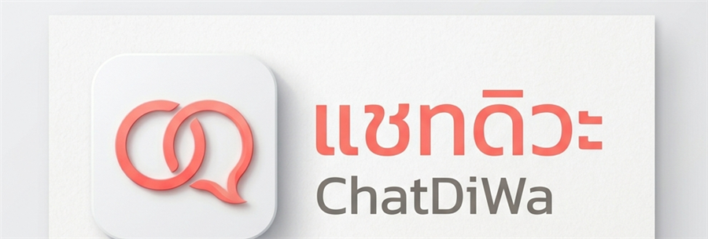

<p align="center"></p>

# ChatDiWa

อ่านแชท TikTok LIVE ออกเสียงให้อัตโนมัติ เสียงเข้าสตรีมผ่าน OBS Browser Source — **ไม่ต้องติดตั้ง virtual audio cable หรือโปรแกรมเสียงเพิ่มเติมใดๆ**

## เริ่มใช้งานแบบง่ายที่สุด (แนะนำสำหรับเพื่อนที่ไม่ถนัดสายโค้ด)

1. ไปที่หน้า [Releases](https://github.com/Babyferret/chatdiwa/releases/latest) โหลดไฟล์ `ChatDiWa.zip`
2. แตกไฟล์ zip (คลิกขวา → Extract All) จะได้โฟลเดอร์ `ChatDiWa` ที่รวมทุกอย่างไว้ในที่เดียว ไม่กระจายไฟล์ปนกับที่อื่น — จะย้ายทั้งโฟลเดอร์ไปวางไว้ที่ Desktop หรือที่ไหนก็ได้
3. เข้าไปในโฟลเดอร์ `ChatDiWa` แล้วดับเบิลคลิก `run.bat`
   - ถ้ายังไม่มี Node.js ในเครื่อง สคริปต์จะถามก่อนว่าจะติดตั้งให้อัตโนมัติไหม (ไม่ติดตั้งเงียบๆ โดยไม่ถาม)
   - รอบแรกๆ npm อาจถามว่า `Ok to proceed? (y)` — พิมพ์ `y` แล้วกด Enter
4. เสร็จแล้ว! ไฟล์ตั้งค่าทุกอย่างจะถูกเก็บไว้ในโฟลเดอร์ `ChatDiWa` เดียวกันนี้ และทุกครั้งที่ดับเบิลคลิก `run.bat` จะได้เวอร์ชันล่าสุดจาก GitHub เสมอโดยอัตโนมัติ ไม่ต้องอัปเดตเอง

## เริ่มใช้งานแบบพิมพ์คำสั่งเอง (สำหรับสาย dev)

1. ติดตั้ง **Node.js** (เวอร์ชัน 18 ขึ้นไป): https://nodejs.org
2. เปิด Terminal แล้วพิมพ์:

```
npx github:Babyferret/chatdiwa
```

ทั้งสองวิธีให้ผลเหมือนกันทุกประการ — `run.bat` แค่ห่อคำสั่งข้างบนไว้ให้ไม่ต้องเปิด Terminal เอง

โปรแกรมจะเริ่มทำงานทันที (ยังไม่เชื่อมต่อ TikTok จนกว่าจะกรอก username) และเปิดหน้าต่างควบคุมให้อัตโนมัติ พร้อมโชว์ 2 ลิงก์ประมาณนี้:

```
เปิดใช้งานที่ http://localhost:3939
- เปิดลิงก์นี้ในเบราว์เซอร์ปกติเพื่อดูแชท/ตั้งค่า/เชื่อมต่อ TikTok
- เพิ่ม http://localhost:3939/?obs=1 เป็น Browser Source ใน OBS เพื่อให้เสียงเข้าสตรีม
```

## หน้าควบคุม

หน้าต่างควบคุมจะเปิดให้อัตโนมัติ (หรือเปิดลิงก์แรกเองในเบราว์เซอร์ปกติก็ได้) มี 2 แท็บ:

- **แชท**: กล่องข้อความเลื่อนดูได้ โชว์คอมเมนต์ทุกอันที่เข้ามา (อันที่ไม่ได้อ่านออกเสียงจะดูจางกว่า)
- **ตั้งค่า**:
  - **การเชื่อมต่อ TikTok**: กรอก/แก้ username แล้วกด **Connect** เพื่อเชื่อมหรือสลับห้อง (ไม่ต้องรีสตาร์ทโปรแกรม) กด **Disconnect** เพื่อตัดการเชื่อมต่อเอง — สถานะปัจจุบันโชว์ตลอดที่มุมขวาบน (จุดสีเขียว = เชื่อมต่อแล้ว, เหลือง = กำลังเชื่อมต่อ, แดง = ผิดพลาด)
  - **เสียง**: เลือกชาย/หญิง ปรับความเร็ว (rate), ระดับเสียงสูงต่ำ (pitch), ความดัง (volume) ได้ด้วย slider (-50% ถึง +50%)
  - **รูปแบบข้อความ**: อ่านแบบ "ชื่อ พูดว่า ข้อความ" หรือ "ข้อความอย่างเดียว"
  - **Read Mode**: เลือก "อ่านทั้งหมด" หรือ "อ่านเฉพาะที่ขึ้นต้นด้วย..." (ตั้งได้หลายตัวอักษรนำหน้า เช่น `.` และ `/`) — คอมเมนต์ที่ไม่เข้าเงื่อนไขยังโชว์ในแชทตามปกติ แค่ไม่ถูกอ่านออกเสียง
  - **Overlay บนหน้าจอ**: เปิด/ปิดการแสดง overlay ชื่อ+ข้อความบน OBS View (ดูหัวข้อถัดไป)
  - **ตัวกรองอื่นๆ**: ความยาวข้อความสูงสุด, จำนวนคิวสูงสุด, บล็อก username, คำที่ไม่อ่านออกเสียง
  - กด **บันทึก** มีผลทันทีโดยไม่ต้องปิดโปรแกรม
  - กด **รีเซ็ตการตั้งค่าทั้งหมด** เพื่อล้างทุกอย่างกลับเป็นค่าเริ่มต้น (รวมถึงตัดการเชื่อมต่อ TikTok ด้วย)

> หน้านี้**ไม่เล่นเสียง** เป็นแค่หน้าดูแชท/ตั้งค่า/เชื่อมต่อเฉยๆ (กันเสียงซ้อนกับ OBS)

## เพิ่มเสียง (และ Overlay) เข้า OBS (ทำครั้งเดียว)

1. เปิด OBS Studio
2. ที่ช่อง **Sources** กดปุ่ม `+` แล้วเลือก **Browser** (หรือ "Browser Source")
3. ตั้งชื่อตามใจ เช่น "ChatDiWa" แล้วกด OK
4. ในช่อง **URL** ใส่ลิงก์ที่สอง (มี `?obs=1` ต่อท้าย) เช่น `http://localhost:3939/?obs=1`
5. กด OK — เสร็จแล้ว! เวลามีคอมเมนต์เข้ามา เสียงจะเข้าสตรีมของคุณโดยอัตโนมัติ

Browser Source อันนี้ตัวเดียวรองรับทั้งเสียงและ overlay โดยควบคุมผ่านสิ่งที่ OBS มีให้อยู่แล้ว:

- **อยากได้แค่เสียง ไม่โชว์อะไรบนจอ**: กดไอคอนรูปตา (👁) ข้าง Source นี้เพื่อซ่อน — เสียงยังออกปกติแม้ซ่อนอยู่
- **อยากได้ overlay โชว์บนจอด้วย**: เปิดใช้ checkbox "แสดง overlay" ในหน้าตั้งค่า แล้วโชว์ Source ตามปกติ (ข้อความชื่อ+คอมเมนต์จะขึ้นมุมล่างซ้ายแล้วค่อยๆ จางหายไปหลัง 8 วินาที เฉพาะคอมเมนต์ที่ถูกอ่านออกเสียงจริง)
- **อยากได้ overlay แต่ไม่เอาเสียง**: ปิด volume ของ Source นี้จาก audio mixer ของ OBS เอง (ไม่ใช่ slider ในแอปเรา เพราะ slider ในแอปคือปรับสำเนียงเสียง ไม่ใช่ mute)

> ต้องใช้ URL ที่มี `?obs=1` สำหรับ OBS เท่านั้น (ต่างจากลิงก์หน้าควบคุม) ไม่งั้นจะไม่มีเสียงออก — และถ้าเปิด `?obs=1` ตรงๆ ในเบราว์เซอร์ปกติจะไม่มีเสียงเช่นกัน (เบราว์เซอร์ทั่วไปบล็อก autoplay แต่ OBS ไม่บล็อก) เป็นเรื่องปกติ ไม่ใช่บั๊ก
>
> ไม่ต้องลง VB-CABLE หรือปรับ audio device ในเครื่องเลย เพราะ OBS จะจับเสียงจากหน้าเว็บนี้ตรงๆ

## ใช้งานระหว่างสตรีม

- เปิดโปรแกรมครั้งถัดๆ ไป ถ้าเคยกรอก username ไว้แล้ว จะเชื่อมต่ออัตโนมัติทันที ไม่ต้องกด Connect ใหม่
- ปรับตั้งค่าได้ทุกเมื่อจากหน้าควบคุมในเบราว์เซอร์ ไม่ต้องแตะ Terminal เลย
- กด `Ctrl+C` ใน Terminal (หรือปิดหน้าต่างที่เปิดจาก `run.bat`) เพื่อปิดโปรแกรม

## ถ้าเชื่อมต่อไม่ติด

- เช็คว่าคุณ**กำลังไลฟ์อยู่จริง**บน TikTok ตอนกด Connect (เชื่อมต่อกับไลฟ์ที่กำลังสดเท่านั้น)
- เช็คว่าใส่ username ถูกต้อง (ดูจาก URL หน้าโปรไฟล์ TikTok ของคุณ ไม่ต้องมี `@`)
- ถ้าหลุดเองระหว่างสตรีม โปรแกรมจะพยายามเชื่อมต่อใหม่ให้อัตโนมัติ — แต่ถ้า**กด Disconnect เอง** โปรแกรมจะไม่เชื่อมต่อใหม่ให้จนกว่าจะกด Connect เอง

## ตั้งค่าใหม่ตั้งแต่ต้น

กดปุ่ม **รีเซ็ตการตั้งค่าทั้งหมด** ในหน้าตั้งค่า — ไม่ต้องไปหาไฟล์ config ลบเองแล้ว

## ChatDiWa เก็บข้อมูลไว้ที่ไหนบ้าง / ถอนการติดตั้งยังไง

ChatDiWa ไม่ได้ลงตัวเองเป็น "โปรแกรม" ของ Windows (ไม่มี installer ไม่มีชื่อขึ้นใน Add/Remove Programs) เพราะเป็นแค่ไฟล์ที่ `npx` ดึงมารันชั่วคราวทุกครั้ง ข้อมูลที่เกี่ยวข้องอยู่ 3 จุด:

1. **ไฟล์ตั้งค่า + แคชเสียงชั่วคราว** — อยู่ในโฟลเดอร์เดียวกับ `run.bat` (เช่นโฟลเดอร์ `ChatDiWa` ที่แตกจาก zip): `chatdiwa.config.json` (การตั้งค่าทั้งหมด) และ `.chatdiwa-audio-cache\` (ไฟล์เสียงชั่วคราว ปกติจะว่างเปล่าเพราะลบตัวเองอัตโนมัติหลังเล่นเสร็จ)
2. **แคชของ npx เอง** — อยู่ที่ `%LocalAppData%\npm-cache\_npx\` เป็นแคชกลางของ npm ไม่ใช่ของ ChatDiWa โดยเฉพาะ
3. **Node.js เอง** — ถ้า `run.bat` ลงให้ผ่าน winget จะติดตั้งเป็นโปรแกรมปกติของ Windows

**ถอนการติดตั้งให้หมดจด:**

1. ลบโฟลเดอร์ `ChatDiWa` ทั้งโฟลเดอร์ (มี `run.bat`, `chatdiwa.config.json`, แคชเสียงอยู่ในนั้นหมด) — แค่นี้ก็ถือว่าถอนแล้วในทางปฏิบัติ ไม่มีอะไรทำงานเบื้องหลังหรือเก็บข้อมูลที่อื่นอีก
2. (ไม่บังคับ) ล้างแคช npx: เปิด Terminal พิมพ์ `npm cache clean --force`
3. (ไม่บังคับ, เฉพาะถ้าไม่ได้ใช้ Node.js ทำอย่างอื่น) ถอน Node.js: Windows Settings → Apps → หา "Node.js" → Uninstall (หรือ `winget uninstall OpenJS.NodeJS.LTS`)
